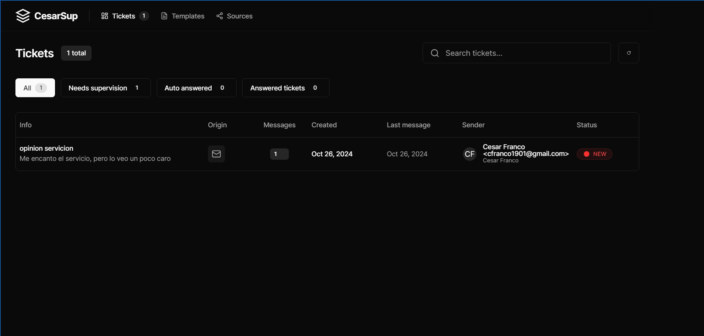
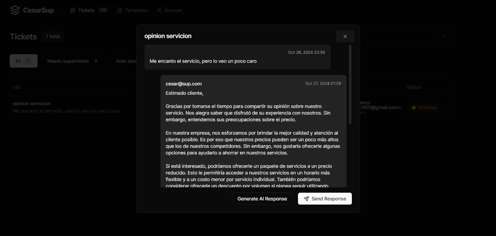

# ServiceBot 🚀
**La solución inteligente para una atención al cliente eficiente y en tiempo real, diseñada para transformar la experiencia del usuario y agilizar el soporte con agentes virtuales de última generación.**

---

## 🌟 ¿Qué es ServiceBot?
**ServiceBot** es un asistente virtual diseñado para gestionar las consultas de tus usuarios de manera automática y eficiente, brindando respuestas rápidas y precisas en tiempo real. Ideal para empresas que buscan mejorar su servicio al cliente y reducir tiempos de espera, ServiceBot utiliza tecnología avanzada de procesamiento de lenguaje natural para comprender y responder a las preguntas de los usuarios de forma intuitiva y personalizada.

---

## 🚀 Ventajas de ServiceBot
- **Respuestas en tiempo real** para mejorar la satisfacción del cliente y reducir el tiempo de espera.
- **Agentes virtuales** avanzados que optimizan el servicio de atención con soporte 24/7.
- **Análisis inteligente** de consultas para identificar áreas de mejora en el soporte.
- **Interfaz amigable y accesible** para una experiencia de usuario intuitiva y sin complicaciones.

---

## 🌐 Demostración en Acción

Observa cómo **ServiceBot** maneja consultas reales en tiempo real, interactuando con los usuarios y ofreciendo soluciones de manera rápida y precisa.

---

## 🚀 Características Principales ✨
- 🤖 **Agentes Virtuales de Atención al Cliente**: Automatiza las interacciones con tus usuarios y resuelve preguntas frecuentes sin intervención humana.
- 📊 **Análisis de Consultas**: Optimiza el servicio de soporte analizando las consultas para mejorar y personalizar las respuestas.
- 🕒 **Disponibilidad en Tiempo Real**: Respuestas al instante, disponibles 24/7 para mejorar la experiencia de tus usuarios.
- 💬 **Interfaz Intuitiva**: Diseñada para una navegación fácil y accesible.

---

## ⚙️ Guía de Instalación
Sigue estos sencillos pasos para implementar **ServiceBot** en tu entorno:

1. Clona el repositorio: `git clone https://github.com/cesarfr2002/CesarServiceBot.git`
2. Navega al directorio: `cd ServiceBot`
3. Instala las dependencias: `npm install`
4. Inicia el proyecto: `npm start`

